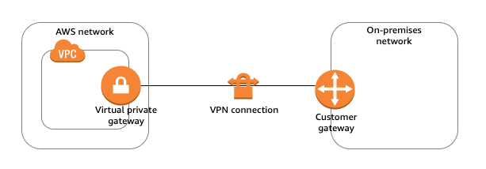

## Components of an AWS Site-to-Site VPN connection?

### Virtual private gateway

- A virtual private gateway is the VPN concentrator on the Amazon side of the Site-to-Site VPN connection.

### Customer gateway

- A customer gateway is a resource that you create in AWS that represents the customer gateway device in your on-premises network.

Answer: https://docs.aws.amazon.com/vpn/latest/s2svpn/how_it_works.html

## AWS Trusted Advisor analyzes your AWS environment and provides best practice recommendations for which of the following categories?

- Cost optimization
- Performance
- Security
- Fault tolerance
- Service limits

